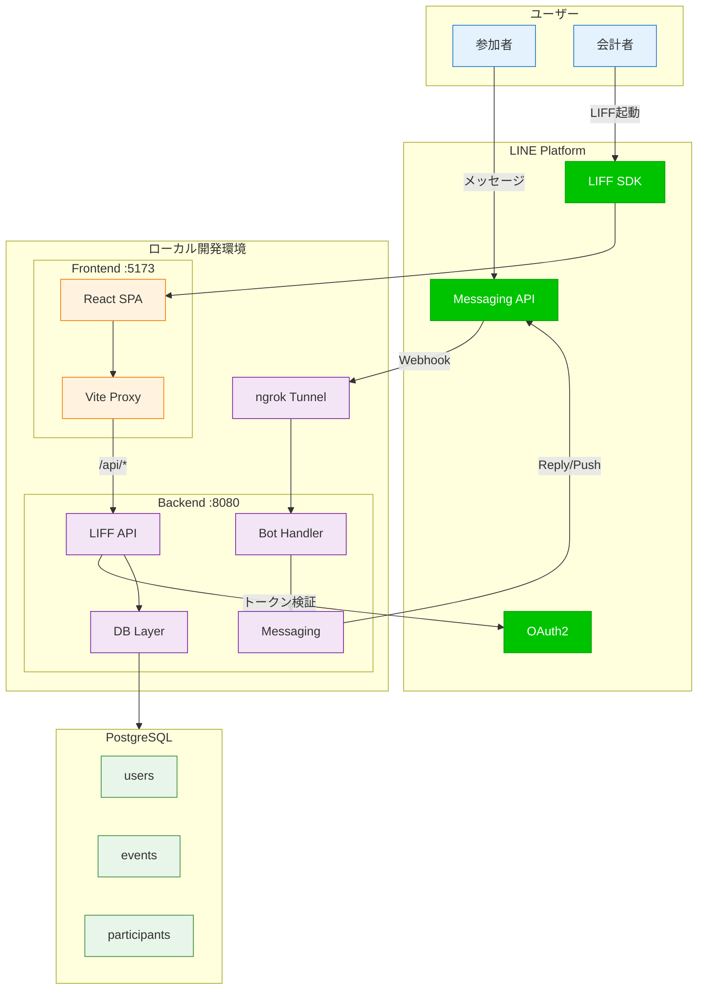
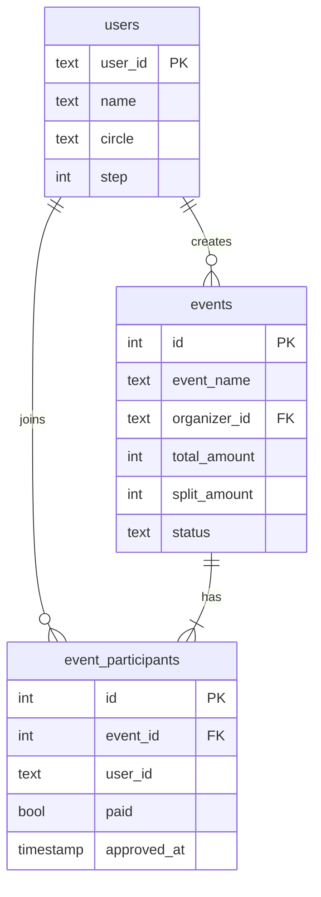
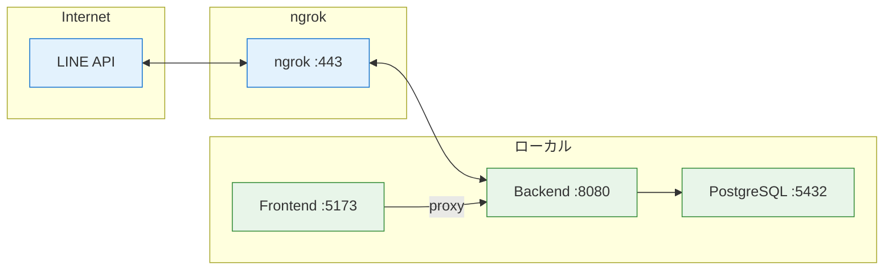

# CirclePay システム構成図

## システム全体図

---

## データベース構成

---

## 開発環境

---

## コンポーネント一覧

| レイヤー | コンポーネント | 役割 |
|---------|--------------|------|
| Frontend | React SPA | LIFF Webアプリ |
| Frontend | Vite Proxy | API転送 |
| Backend | Bot Handler | LINE Bot処理 |
| Backend | LIFF API | Web API |
| Backend | Messaging | メッセージ送信 |
| Backend | DB Layer | データ操作 |
| Database | PostgreSQL | データ永続化 |
