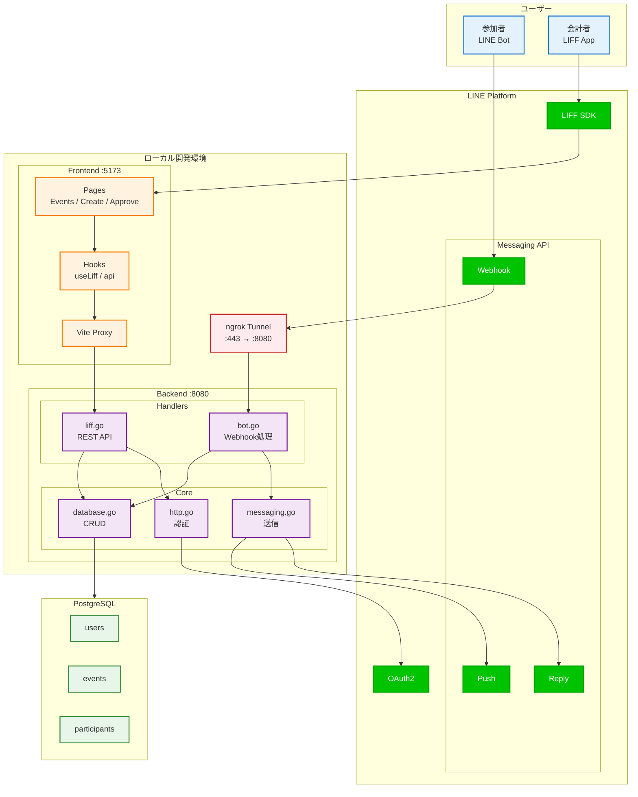
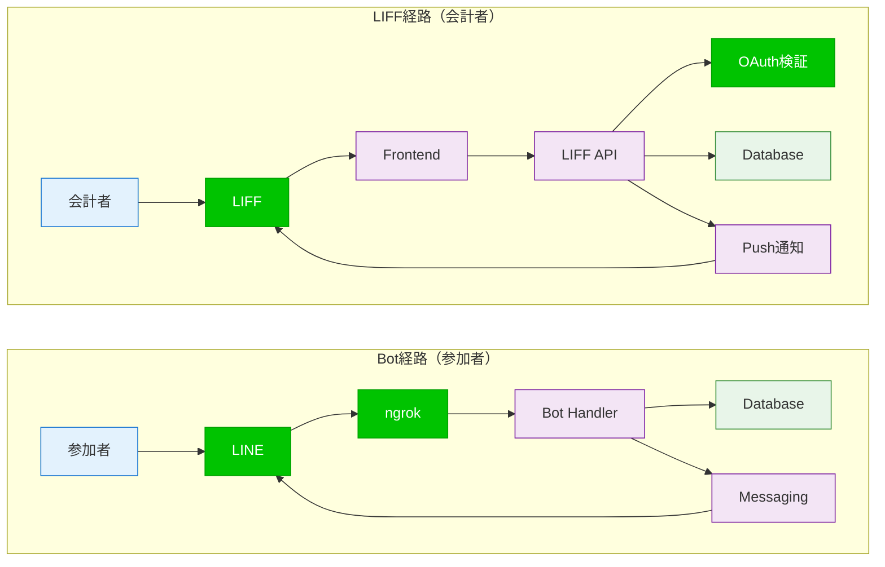
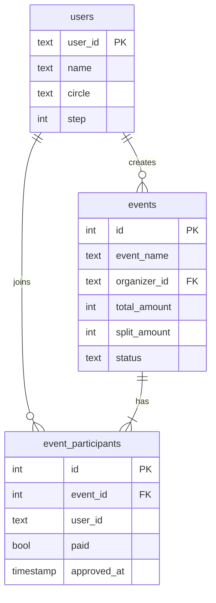
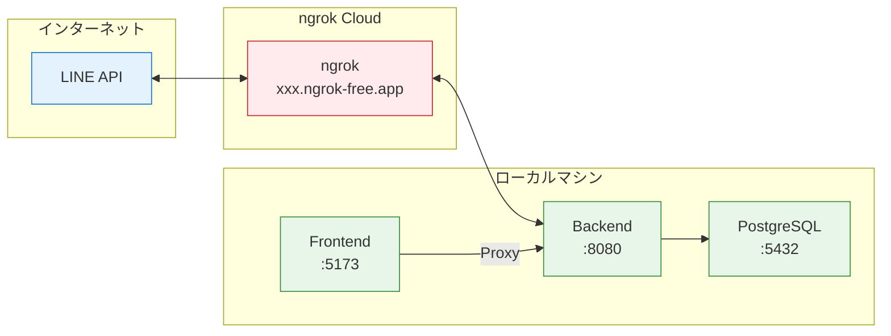

# CirclePay システム構成図

## システム全体図

---

## データフロー

---

## データベース構成

---

## 開発環境ネットワーク

---

## コンポーネント詳細

| レイヤー | ファイル | 役割 |
|---------|---------|------|
| Frontend | `pages/*.tsx` | イベント一覧・作成・承認画面 |
| Frontend | `useLiff.ts` | LIFF認証・状態管理 |
| Frontend | `api.ts` | Backend APIクライアント |
| Backend | `main.go` | ルーティング・静的配信 |
| Backend | `bot.go` | LINE Webhook処理 |
| Backend | `liff.go` | LIFF用REST API |
| Backend | `http.go` | 認証ミドルウェア |
| Backend | `messaging.go` | LINE送信（Reply/Push） |
| Backend | `database.go` | PostgreSQL操作 |
| Database | `users` | ユーザー情報 |
| Database | `events` | 割り勘イベント |
| Database | `event_participants` | 参加者・支払い状態 |
