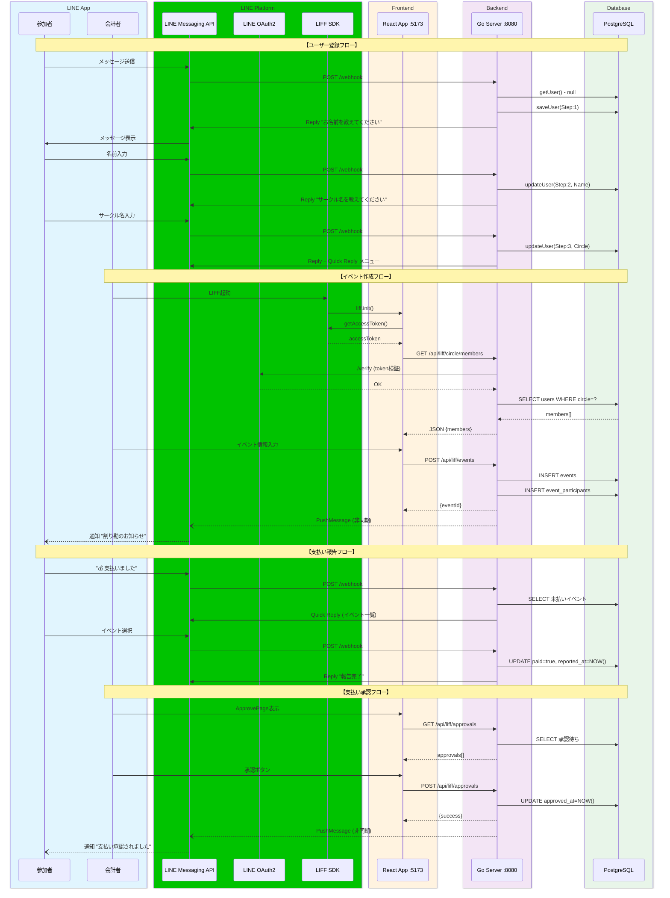
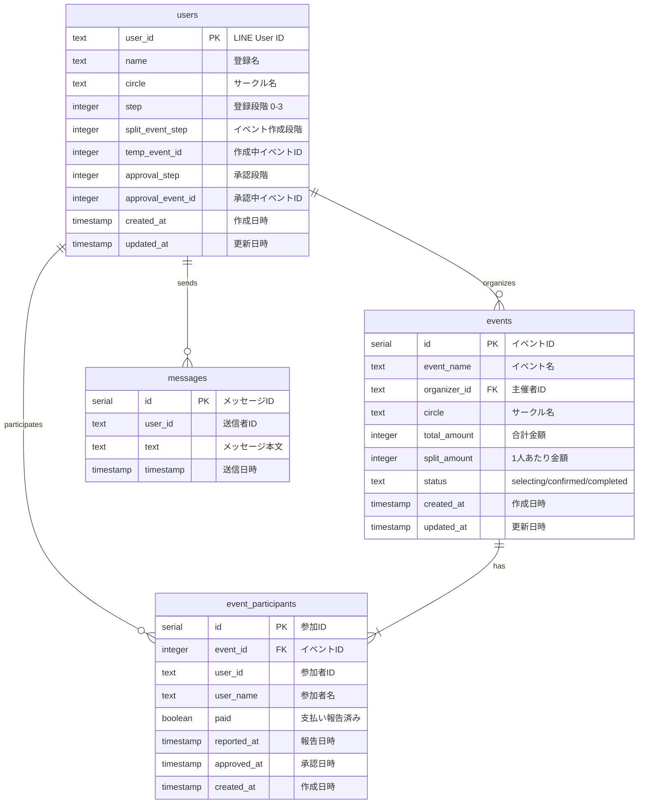
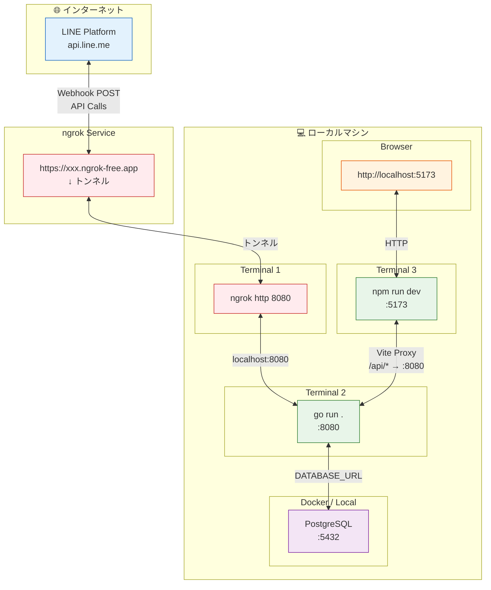

# CirclePay システム構成図

CirclePayのローカル開発環境のシステム構成を可視化した図です。

## 統合システム構成図

```mermaid
flowchart TB
    %% ==================== ユーザー層 ====================
    subgraph Users["👥 ユーザー層"]
        direction LR
        Participant["🙋 参加者<br/>・支払い報告<br/>・状況確認"]
        Organizer["👤 会計者（オーガナイザー）<br/>・イベント作成<br/>・支払い承認"]
    end

    %% ==================== LINE Platform ====================
    subgraph LINE_Platform["☁️ LINE Platform"]
        direction TB

        subgraph LINE_Bot_API["LINE Messaging API"]
            direction LR
            Webhook["📥 Webhook<br/>メッセージ受信"]
            Reply["📤 Reply API<br/>返信"]
            Push["📤 Push API<br/>プッシュ通知"]
            Multicast["📤 Multicast API<br/>一斉送信"]
        end

        subgraph LINE_OAuth["LINE OAuth2"]
            direction LR
            TokenVerify["🔐 /verify<br/>トークン検証"]
            ProfileAPI["👤 /profile<br/>プロフィール取得"]
        end

        LIFF_SDK["📱 LIFF SDK<br/>・liff.init()<br/>・getAccessToken()<br/>・getProfile()<br/>・closeWindow()"]
    end

    %% ==================== ngrok トンネル ====================
    subgraph ngrok_layer["🔗 ngrok Tunnel（本番テスト時）"]
        ngrok["https://xxx.ngrok-free.app<br/>↕️ HTTP Tunnel"]
    end

    %% ==================== ローカル開発環境 ====================
    subgraph Local_Environment["🖥️ ローカル開発環境"]
        direction TB

        %% ---------- Frontend ----------
        subgraph Frontend["📦 Frontend (React + Vite) :5173"]
            direction TB

            subgraph React_App["React SPA"]
                direction LR
                main_tsx["main.tsx<br/>エントリー"]
                LiffApp["LiffApp.tsx<br/>Router + ErrorBoundary"]
            end

            subgraph LIFF_Pages["LIFF ページ"]
                direction LR
                EventsPage["📋 EventsPage<br/>/events<br/>イベント一覧"]
                CreateEvent["➕ CreateEvent<br/>/create<br/>イベント作成"]
                ApprovePage["✅ ApprovePage<br/>/approve<br/>支払い承認"]
            end

            subgraph LIFF_Core["LIFF Core"]
                direction LR
                useLiff["🔧 useLiff.ts<br/>・isLoggedIn<br/>・userId<br/>・accessToken"]
                api_ts["📡 api.ts<br/>・getMyEvents()<br/>・createEvent()<br/>・approvePayments()"]
            end

            Vite_Proxy["⚡ Vite Proxy<br/>/api/* → :8080"]
        end

        %% ---------- Backend ----------
        subgraph Backend["📦 Backend (Go) :8080"]
            direction TB

            subgraph Routing_Layer["main.go - ルーティング & インフラ"]
                direction LR
                env_load["📄 .env読込"]
                http_routing["🔀 ルーティング設定"]
                static_serve["📁 静的ファイル配信<br/>../frontend/dist"]
            end

            subgraph Bot_Layer["bot.go - LINE Bot 処理"]
                direction TB
                webhook_handler["📥 handleWebhook()<br/>署名検証(HMAC-SHA256)"]
                message_handler["💬 handleMessage()<br/>メッセージディスパッチ"]

                subgraph User_Registration["ユーザー登録フロー"]
                    step1["Step 1: 名前入力"]
                    step2["Step 2: サークル入力"]
                    step3["Step 3: 完了"]
                end

                subgraph Quick_Reply_Menu["Quick Reply メニュー"]
                    qr_payment["💰 支払いました"]
                    qr_status["📊 状況確認"]
                    qr_organizer["👤 会計者になる"]
                end
            end

            subgraph HTTP_Layer["http.go - HTTPミドルウェア"]
                direction LR
                withAuth["🔐 WithAuth()<br/>認証ミドルウェア"]
                apiContext["📋 APIContext<br/>UserID, DisplayName"]
            end

            subgraph LIFF_Layer["liff.go - LIFF API エンドポイント"]
                direction TB

                subgraph LIFF_Endpoints["API Endpoints"]
                    direction LR
                    api_me["GET /api/liff/me<br/>ユーザー情報"]
                    api_register["POST /api/liff/register<br/>ユーザー登録"]
                    api_events_get["GET /api/liff/events<br/>イベント一覧"]
                    api_events_post["POST /api/liff/events<br/>イベント作成"]
                    api_approvals_get["GET /api/liff/approvals<br/>承認待ち一覧"]
                    api_approvals_post["POST /api/liff/approvals<br/>支払い承認"]
                    api_members["GET /api/liff/circle/members<br/>メンバー一覧"]
                end
            end

            subgraph Messaging_Layer["messaging.go - メッセージ送信"]
                direction TB

                subgraph Content_Strategy["Content (Strategy Pattern)"]
                    direction LR
                    text_content["📝 TextContent"]
                    qr_content["📝 QuickReplyContent"]
                end

                subgraph Delivery_Strategy["Delivery (Strategy Pattern)"]
                    direction LR
                    reply_delivery["📤 ReplyDelivery"]
                    push_delivery["📤 PushDelivery"]
                    multicast_delivery["📤 MulticastDelivery"]
                end

                send_message["🚀 SendMessage()<br/>統一送信関数"]
            end

            subgraph Database_Layer["database.go - データベース操作"]
                direction LR
                initDB["🔌 initDB()<br/>PostgreSQL接続"]
                createTables["📊 createTables()<br/>スキーマ作成"]
                crud_ops["📝 CRUD操作<br/>getUser, saveUser,<br/>updateUser, getEvent"]
            end

            subgraph Scheduler_Layer["Scheduler"]
                reminder["⏰ startReminderScheduler()<br/>毎日12:00 催促送信"]
            end
        end
    end

    %% ==================== データベース ====================
    subgraph Database["🗄️ PostgreSQL データベース"]
        direction TB

        subgraph Tables["テーブル構造"]
            direction LR

            users_tbl["👤 users<br/>━━━━━━━━━━━━<br/>user_id (PK)<br/>name<br/>circle<br/>step (0-3)<br/>created_at"]

            events_tbl["📅 events<br/>━━━━━━━━━━━━<br/>id (PK)<br/>event_name<br/>organizer_id (FK)<br/>total_amount<br/>split_amount<br/>status"]

            participants_tbl["👥 event_participants<br/>━━━━━━━━━━━━<br/>id (PK)<br/>event_id (FK)<br/>user_id<br/>paid<br/>reported_at<br/>approved_at"]

            messages_tbl["💬 messages<br/>━━━━━━━━━━━━<br/>id (PK)<br/>user_id<br/>text<br/>timestamp"]
        end

        subgraph Relations["リレーション"]
            rel1["users 1──∞ events<br/>(organizer)"]
            rel2["users 1──∞ event_participants"]
            rel3["events 1──∞ event_participants"]
        end
    end

    %% ==================== 接続線 ====================

    %% ユーザー → LINE
    Participant -->|"LINE App<br/>メッセージ送信"| Webhook
    Organizer -->|"LINE App内<br/>LIFF起動"| LIFF_SDK

    %% LINE → ngrok → Backend (Bot)
    Webhook -->|"POST /webhook"| ngrok
    ngrok -->|"HTTP Tunnel"| webhook_handler

    %% Backend → LINE (応答)
    reply_delivery -->|"POST"| Reply
    push_delivery -->|"POST"| Push
    multicast_delivery -->|"POST"| Multicast

    %% LIFF SDK → Frontend
    LIFF_SDK -->|"liff.init()<br/>getAccessToken()"| useLiff

    %% Frontend 内部
    main_tsx --> LiffApp
    LiffApp --> LIFF_Pages
    LIFF_Pages --> LIFF_Core
    api_ts -->|"fetch /api/*"| Vite_Proxy

    %% Frontend → Backend
    Vite_Proxy -->|"プロキシ転送"| LIFF_Endpoints

    %% Backend 認証
    withAuth -->|"検証"| TokenVerify
    withAuth -->|"プロフィール"| ProfileAPI
    LIFF_Endpoints --> withAuth

    %% Backend 内部
    webhook_handler --> message_handler
    message_handler --> User_Registration
    message_handler --> Quick_Reply_Menu
    LIFF_Endpoints --> crud_ops
    send_message --> Delivery_Strategy
    Content_Strategy --> send_message

    %% Backend → Database
    initDB -->|"DATABASE_URL"| Database
    crud_ops --> Tables

    %% Scheduler
    reminder -->|"未払い取得"| crud_ops
    reminder -->|"催促送信"| push_delivery

    %% Quick Reply → LIFF
    qr_organizer -.->|"LIFF URL"| LIFF_SDK

    %% ==================== スタイル定義 ====================
    classDef userStyle fill:#e1f5fe,stroke:#01579b,stroke-width:2px
    classDef lineStyle fill:#00c300,stroke:#00a000,color:#fff,stroke-width:2px
    classDef ngrokStyle fill:#ffebee,stroke:#c62828,stroke-width:2px
    classDef frontendStyle fill:#fff3e0,stroke:#e65100,stroke-width:2px
    classDef backendStyle fill:#f3e5f5,stroke:#7b1fa2,stroke-width:2px
    classDef dbStyle fill:#e8f5e9,stroke:#2e7d32,stroke-width:2px
    classDef apiStyle fill:#e8eaf6,stroke:#3f51b5,stroke-width:2px
    classDef msgStyle fill:#fffde7,stroke:#f9a825,stroke-width:2px

    class Participant,Organizer userStyle
    class Webhook,Reply,Push,Multicast,TokenVerify,ProfileAPI,LIFF_SDK lineStyle
    class ngrok ngrokStyle
    class main_tsx,LiffApp,EventsPage,CreateEvent,ApprovePage,useLiff,api_ts,Vite_Proxy frontendStyle
    class webhook_handler,message_handler,step1,step2,step3,qr_payment,qr_status,qr_organizer,withAuth,apiContext backendStyle
    class api_me,api_register,api_events_get,api_events_post,api_approvals_get,api_approvals_post,api_members apiStyle
    class text_content,qr_content,reply_delivery,push_delivery,multicast_delivery,send_message msgStyle
    class users_tbl,events_tbl,participants_tbl,messages_tbl,rel1,rel2,rel3 dbStyle
```

---

## データフロー詳細図

主要なユースケースのデータフローをシーケンス図で表現します。

---

## データベーススキーマ図

ER図でテーブル間のリレーションを表現します。

---

## 開発環境ネットワーク図

ローカル開発時のネットワーク構成を表現します。

---

## コンポーネント概要

### ユーザー層
| ロール | 使用ツール | 主な機能 |
|--------|-----------|---------|
| 参加者 | LINE Bot (Quick Reply) | 支払い報告、状況確認 |
| 会計者 | LIFF Web App | イベント作成、支払い承認 |

### LINE Platform
| サービス | 用途 |
|---------|------|
| Messaging API | Bot メッセージの送受信 |
| OAuth2 | LIFF トークン検証 |
| LIFF SDK | Web アプリ認証・連携 |

### Backend (Go)
| ファイル | 責務 |
|---------|------|
| `main.go` | ルーティング、インフラ設定 |
| `bot.go` | LINE Bot Webhook 処理 |
| `liff.go` | LIFF API エンドポイント |
| `http.go` | 認証ミドルウェア |
| `messaging.go` | メッセージ送信 (Strategy Pattern) |
| `database.go` | PostgreSQL CRUD 操作 |

### Frontend (React + TypeScript)
| ファイル | 責務 |
|---------|------|
| `main.tsx` | エントリーポイント |
| `LiffApp.tsx` | Router + ErrorBoundary |
| `useLiff.ts` | LIFF 認証状態管理 |
| `api.ts` | Backend API クライアント |
| `pages/*.tsx` | 各ページコンポーネント |

### Database (PostgreSQL)
| テーブル | 説明 |
|---------|------|
| `users` | ユーザー情報・登録状態 |
| `events` | 割り勘イベント |
| `event_participants` | イベント参加者・支払い状態 |
| `messages` | メッセージログ |
